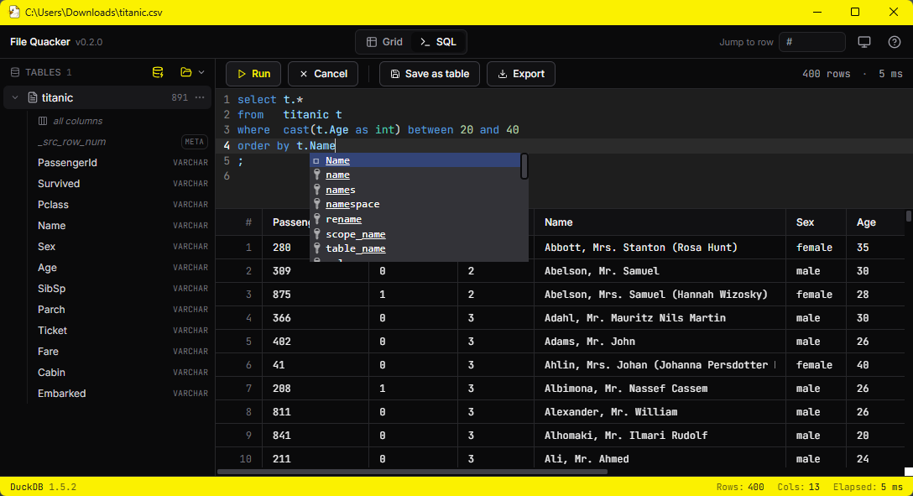

# File Quacker

[](../../actions/workflows/python.yml)
[](../../actions/workflows/frontend.yml)
[](LICENSE)

<p align="center">
  
</p>

File Quacker is a local-first viewer, explorer, and exporter for **CSV,
Parquet, and Excel** files. Built on **DuckDB** as the query engine and
rendered through **pywebview**.

The short version: open large flat files quickly, inspect what is actually in
them, run real SQL, profile columns, derive cleaner typed copies, and export
the results to SQL Server or another file format — all from your laptop.

## Why this exists

I'm a data engineer, so I spend a lot of time dealing with flat files from 
vendors, partners, legacy systems, and the occasional spreadsheet that has 
become mission-critical. When one of those files arrives with bad data or 
formatting quirks that break an ETL pipeline, I need a quick way to inspect it, 
understand what changed, and either report the issue back or fix it locally.

I wanted a simple desktop tool that made those files easier to work with before
loading them into a warehouse or handing them off to another process. Not a
full BI platform. Not a cloud service. Just a fast, local workspace where I can
open the file, see the data, query it, profile it, clean up the shape a bit,
and move on.

So I wrote File Quacker to scratch my own itch.

> **Local-only by design.** No telemetry, no cloud, no network calls, except
> when you explicitly export to a SQL Server target.

---

<br>

<p align="center">
  
</p>

## Features

- **Open big files fast.** CSV / TSV / pipe / Parquet / Excel, with delimiter
  and encoding auto-detect. A raw-fidelity load mode preserves source values as
  text so the app does not quietly turn codes into numbers or dates.
- **Run real SQL.** CodeMirror 6 editor over DuckDB SQL, with drag/drop tables
  and columns from the sidebar, F5 / Ctrl+Enter to run, and Esc to interrupt.
- **Browse results without loading everything into memory.** The grid uses
  windowed fetching, supports sortable columns, sticky headers, click-to-select,
  and Ctrl+C-as-TSV.
- **Profile columns.** Quickly check top values, fill %, distinct counts,
  min/max, and per-type stats for numeric, string, temporal, and varchar-like
  data.
- **Auto-type / Derive.** Clone a varchar/raw table into a typed table with
  inferred `INT`, `DECIMAL(p,s)`, `DATE`, `TIMESTAMP`, and related types. You
  can also pick types per column and preview the result first.
- **Generate DDL.** Create SQL Server or DuckDB `CREATE TABLE` statements sized
  from the observed data.
- **Export where the data needs to go.** Export to SQL Server, or write back
  out to CSV / TSV / pipe / Parquet / Excel.
- **Import from SQL Server.** Pull a table or query into the local workspace.
- **Use the theme you prefer.** System / light / dark support, including the SQL
  editor.

---

## Install

### Pre-built `.exe` (Windows)

Download the latest `file_quacker.exe` from the
[Releases](../../releases) page and run it. No installer.

If the window opens but the body is blank white, you are probably missing the
**Microsoft Edge WebView2 Runtime**. See [Troubleshooting](#troubleshooting)
below.

### From source

Requires Python 3.11+ and Node 18+.

```bash
git clone <this repo>
cd "File Quacker"

# Python deps
python -m venv .venv
.venv\Scripts\activate          # or: source .venv/bin/activate
pip install -r requirements.txt

# Frontend build
npm --prefix frontend install
npm --prefix frontend run build

# Run
python -m file_quacker
```

### Build the standalone `.exe`

```bash
pip install -r requirements-dev.txt
npm --prefix frontend run build
pyinstaller file_quacker.spec
# → dist/file_quacker.exe (~27 MB, system WebView2, no Chromium bundled)
```

---

## Dev

Vite hot-reload + pywebview shell, both managed by `dev.py`:

```bash
pip install -r requirements-dev.txt
npm --prefix frontend install
python dev.py
```

`dev.py` starts the Vite dev server on :5173, waits until it is ready, then
launches `python -m file_quacker --dev` pointed at it. Closing either process
tears both down.

---

## Supported platforms

**Windows 10 / 11 / Server 2019+** today. The architecture is portable
(DuckDB, pywebview, Vue, and pyodbc are all cross-platform; the few Win32 calls
already no-op elsewhere), but the build pipeline currently emits a Windows
`.exe` only. macOS / Linux builds are on the roadmap.

---

## Troubleshooting

### "Window opens but the body is blank white"

You are probably missing the **Microsoft Edge WebView2 Runtime**. It is *not*
the same thing as Edge — installing the browser does not necessarily install
the runtime, and vice versa.

| Windows version       | WebView2 Runtime status                          |
|-----------------------|--------------------------------------------------|
| Windows 11            | Pre-installed.                                   |
| Windows 10            | Usually auto-installed via Windows Update.       |
| Windows Server 2022   | Pre-installed.                                   |
| Windows Server 2019   | **Not installed by default. Install manually.**  |
| Windows Server 2016   | **Not installed by default. Install manually.**  |

Download and run the **Evergreen Standalone Installer (x64)** from Microsoft
(free, official):
<https://developer.microsoft.com/en-us/microsoft-edge/webview2/>

Use the **Evergreen Standalone** variant (machine-wide install) rather than the
per-user bootstrapper, especially in shared / RDP / service-account
environments. Per-user installs only work for the account that ran the
installer.

### Other places this can break even when WebView2 is installed

- **AppLocker or Software Restriction Policies** blocking `msedgewebview2.exe`
  (under `Program Files (x86)\Microsoft\EdgeWebView\Application\<ver>\`). The
  symptom can look the same as a missing runtime; check the System and
  Application event logs for denial events on that exe.
- **AntiVirus quarantine** of the WebView2 process or its cache directory.
- **Read-only `%LOCALAPPDATA%`** in hardened or roamed profiles. WebView2 caches
  under `%LOCALAPPDATA%\<exe-name>\EBWebView`; if it cannot write there, it may
  fail silently. Workaround: point it at a writable folder before launching:

  ```bat
  set WEBVIEW2_USER_DATA_FOLDER=C:\Temp\fq-webview
  file_quacker.exe
  ```

### SQL Server export

The SQL Server export target requires the **Microsoft ODBC Driver for SQL
Server (18)**. Install it on any machine that will run exports. It is not needed
for read-only use or file-only exports.
<https://learn.microsoft.com/en-us/sql/connect/odbc/download-odbc-driver-for-sql-server>

---

## Contributing

See [`CONTRIBUTING.md`](CONTRIBUTING.md). Style rules live in
[`docs/coding_conventions.md`](docs/coding_conventions.md). Be sure to read both
before opening a PR.

## Security

See [`SECURITY.md`](SECURITY.md) for how to report vulnerabilities.

## Code of Conduct

See [`CODE_OF_CONDUCT.md`](CODE_OF_CONDUCT.md).

## License

MIT - see [`LICENSE`](LICENSE).
